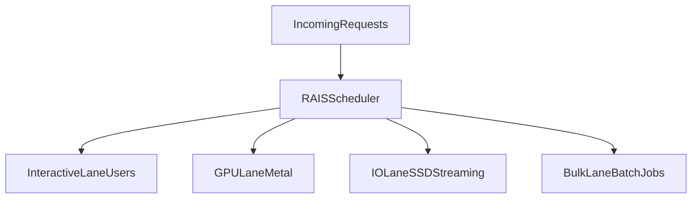

<h1 align="center">Rais</h1>

<p align="center"><strong>Runtime for AI Scheduling</strong></p>

<p align="center">
  <a href="https://github.com/deepsoftworks/rais/actions/workflows/ci.yml"></a>
  <a href="LICENSE"></a>
  <a href="https://github.com/deepsoftworks/rais/releases"></a>
  
</p>

<p align="center"><strong>Run multiple LLM requests on Apple Silicon without latency spikes.</strong></p>

---

Rais is a C++ runtime that schedules AI inference workloads across CPU, GPU
(Metal), and IO to keep real-time requests fast even under heavy load.

## Why use Rais 

- 3.4x faster time-to-first-token under load
- Zero-downtime model switching
- 1.15-1.20x higher throughput via IO/GPU overlap

## Who is this for

- Running local LLMs (MLX, llama.cpp, etc.)
- Building inference servers on Apple Silicon
- Anyone hitting latency spikes with concurrent requests

## Scheduler layout



## Demo

```text
6 concurrent requests (3 interactive, 3 background)

Naive FIFO:     Interactive TTFT ~4.8s
Rais Priority:  Interactive TTFT ~1.4s
```

These numbers come from the `Llama-3.2-1B-Instruct-4bit` concurrent benchmark
already included in this repo.

## Comparison

| Feature | Thread Pool | Rais |
|---|---|---|
| Priority scheduling | ❌ | ✅ |
| GPU-aware | ❌ | ✅ |
| IO/GPU overlap | ❌ | ✅ |
| Model hot-swap | ❌ | ✅ |

## Works with

- MLX / mlx-lm
- llama.cpp (integration example included)
- PyTorch (via bindings)

## The problem

Running LLMs in production on Apple Silicon surfaces three bottlenecks that
inference engines do not solve on their own:

1. **Contention between requests.** When multiple prompts arrive at once, a
   naive FIFO queue makes real-time users wait behind long batch jobs.
   Benchmarks on Llama-3.2-1B with 6 concurrent clients show users waiting
   ~4.8 seconds for their first token when background work is ahead of them.

2. **SSD-to-GPU stalls.** Loading model weights layer-by-layer from disk is
   sequential by default — the GPU sits idle while each layer reads in. On
   real LLM weights (SmolLM2-135M, TinyLlama-1.1B), Rais's IO pipeline
   delivers **1.15-1.20x higher throughput** by overlapping disk reads with
   compute.

3. **Model switching downtime.** Swapping between models (e.g. changing
   assistant persona or loading a fine-tune) normally requires draining all
   in-flight requests before unloading. With Rais, the new model loads in the
   background on a dedicated task while the old model keeps serving.

## What Rais does

Rais provides a task scheduler with five priority lanes that map directly to
the different classes of work in an inference server:

| Lane | Target | Use |
|---|---|---|
| `Interactive` | < 5ms submit-to-start | Real-time user requests |
| `Background` | Best-effort | Model hot-swap, logging, embeddings |
| `Bulk` | Deferred | Batch jobs, eval runs |
| `GPU` | Metal async | Compute kernel dispatch |
| `IO` | Dedicated threads | SSD weight reads, never blocks CPU |

When a real-time request arrives while batch jobs are queued, Rais jumps it
to the front. In the 6-client benchmark above, this reduces interactive TTFT
from **4,829ms to 1,438ms — a 3.4x improvement** with no change to total
throughput.

## How it works

### Priority scheduling
The scheduler maintains a lock-free MPMC ring for normal tasks and a separate
min-heap for deadline tasks (served earliest-deadline-first). Each worker
checks its local Chase-Lev deque, then the deadline heap, then the global
queue, then steals from a random peer. Interactive tasks beat Background tasks
beat Bulk tasks — with starvation promotion (100ms / 500ms) ensuring low-
priority work eventually completes.

### IO pipeline
`Lane::IO` tasks run on a dedicated thread pool (default: 2 threads) with
their own MPMC queue, completely isolated from CPU compute workers. Reads use
`pread()` for thread safety and `F_NOCACHE` to bypass the kernel page cache —
layer weights are used once per forward pass and shouldn't evict hot data.

### Layer streaming
`LayerStreamer` maintains a triple-buffered ring of GPU buffers. While the
GPU computes layer N, layer N+1 is already in a Metal buffer, and layer N+2
is being read from SSD. The IO lane drives the reads; the GPU lane drives
compute. Neither stalls waiting for the other.

### Model hot-swap
`ModelManager` submits a new model load as a `Background` task. The old model
keeps serving `Interactive` requests throughout. On success, the old model
unloads atomically and the ready callback fires. Concurrent swap requests
cancel the in-flight load and take over cleanly.

### Memory management
A lock-free slab allocator handles task objects at ~83ns per alloc
(~124M ops/sec), eliminating `make_shared` overhead on the hot path.
`MetalBufferPool` buckets GPU buffers by size class (4KB–256MB) and reuses
them across forward passes, eliminating the per-layer `newBufferWithLength:`
cost. `MemoryMonitor` tracks pool utilization against a configurable budget
with Warning/Critical thresholds for backpressure signaling.

## Measured results

All measurements on Apple Silicon (M-series), release build.

**Concurrent request scheduling** (Llama-3.2-1B-Instruct-4bit, 6 clients,
3 interactive / 3 background, background batch pre-queued):

| Metric | Naive FIFO | Rais Priority | Speedup |
|---|---|---|---|
| Interactive TTFT | 4,829 ms | 1,438 ms | **3.4x** |
| Interactive E2E | 5,653 ms | 2,254 ms | **2.5x** |

**Layer-streaming throughput** (real weight files, IO/compute overlapped):

| Model | Naive | Rais | Speedup |
|---|---|---|---|
| SmolLM2-135M (257 MB, 31 layers) | 157 tok/s | 188 tok/s | **1.20x** |
| TinyLlama-1.1B (2.1 GB, 23 layers) | 15.5 tok/s | 17.8 tok/s | **1.15x** |

**Subsystem microbenchmarks:**

| Component | Result |
|---|---|
| MPMC queue (4P4C, cache-line padded) | 5.87M ops/sec |
| Work-stealing deque steal (4 thieves, p50) | 125 ns |
| Slab allocator alloc (single thread, p50) | 83 ns |
| Scheduler Interactive dispatch (p50) | 228 µs |

## Quick start

Clone, install dependencies, and build:

```bash
git clone https://github.com/deepsoftworks/rais.git && cd rais
./install.sh
cmake --build build --target priority_example minimal_submit_example
./build/priority_example
```

The example simulates 6 concurrent requests (3 batch + 3 interactive) hitting
a single-threaded decoder. Rais jumps the interactive requests to the front of
the queue so they start before the batch jobs — no code changes to your model
needed.

### Minimal drop-in usage

```cpp
rais::Scheduler sched;

sched.submit([&] {
    generate(prompt);
}, rais::Lane::Interactive);
```

Runnable source: `examples/minimal_submit.cpp`

```bash
cmake --build build --target minimal_submit_example
./build/minimal_submit_example
```

### Python bindings (preview)

Build optional bindings with pybind11:

```bash
WITH_PYTHON=1 ./install.sh
PYTHONPATH=build python3 -c "import rais; print(rais.Scheduler)"
```

### llama.cpp integration example

Use Rais lane scheduling around llama.cpp decode loops:

```bash
cmake --build build --target llama_cpp_integration_example
./build/llama_cpp_integration_example
```

Example source: `examples/llama_cpp_integration.cpp`

### Server mode example

Run a minimal scheduler-backed server loop:

```bash
cmake --build build --target rais_server
./build/rais_server --model llama
```

## Integrating with mlx-lm

Rais sits between your inference loop and the hardware. It does not replace
`mlx-lm` or any other inference engine — it decides *which* request runs
next and when to prefetch the next layer from disk.

**Priority scheduling** — wrap your `mlx_lm.generate()` calls in Rais tasks:

```cpp
#include <rais/scheduler.hpp>

rais::Scheduler sched({.num_workers = 4});

// User-facing request — low latency
auto h = sched.submit([&]() {
    // call your generate / decode function here
    run_inference(prompt, model, tokenizer);
}, rais::Lane::Interactive);

// Background batch job — yields to interactive
sched.submit([&]() {
    run_batch_eval(dataset, model, tokenizer);
}, rais::Lane::Bulk);

h.wait(); // interactive request finishes first
```

**Layer streaming** — overlap SSD reads with GPU compute:

```cpp
#include <rais/layer_streamer.hpp>
#include <rais/metal_allocator.hpp>

rais::MetalBufferPool pool(device);
rais::LayerStreamer streamer(sched, pool, {
    .layer_size_bytes = layer_bytes,
    .num_buffer_slots = 3,       // triple-buffer
    .model_dir = "models/llama",
    .num_layers = 32,
});

streamer.start_prefetch(0);      // fill the pipeline
for (size_t i = 0; i < 32; ++i) {
    auto h = streamer.request_layer(i, [&](void* buf) {
        // buf is a Metal shared buffer with layer weights
        run_layer_forward(i, buf);
    });
    h.wait();
    streamer.release_layer(i);   // recycle the buffer slot
}
```

**Model hot-swap** — switch models without downtime:

```cpp
#include <rais/model_manager.hpp>

rais::ModelManager mgr(sched);
mgr.swap("models/llama-v2",
    [](const std::string& path) { /* load_fn */ },
    [](const std::string& path) { /* unload_fn */ },
    [](bool ok) { printf("swap %s\n", ok ? "done" : "failed"); });

// Old model keeps serving interactive requests throughout.
// When the swap completes, old model is unloaded atomically.
```

## Building

Requires macOS on Apple Silicon (M1+), CMake 3.20+, Xcode command line tools,
and [Catch2 v3](https://github.com/catchorg/Catch2).

```bash
brew install catch2
cmake -B build -DCMAKE_BUILD_TYPE=Release
cmake --build build
ctest --test-dir build --output-on-failure
```

Optional Python bindings:

```bash
brew install pybind11
cmake -B build -DCMAKE_BUILD_TYPE=Release -DRAIS_BUILD_PYTHON=ON -Dpybind11_DIR="$(brew --prefix pybind11)/share/cmake/pybind11"
cmake --build build --target pyrais
```

## Running benchmarks

```bash
cmake -B build -DCMAKE_BUILD_TYPE=Release
cmake --build build
./build/bench_queue
./build/bench_deque
./build/bench_allocator
./build/bench_scheduler
./build/bench_metal
```

**LLM layer-streaming benchmark** (requires model files from `fetch_model.py`):
```bash
python3 experiments/fetch_model.py HuggingFaceTB/SmolLM2-135M
./build/bench_inference_llm experiments/models/smollm2-135m
```

**Concurrent request scheduling benchmark** (requires MLX):
```bash
pip install mlx mlx-lm
python3 experiments/bench_mlx_concurrent.py --model llama1b --clients 6
```

**Cross-tool comparison artifact** (naive thread pool + Rais + optional llama.cpp baseline):
```bash
python3 experiments/bench_compare_tools.py --rais-tsv experiments/mlx_concurrent_results.tsv
python3 experiments/bench_compare_tools.py --rais-tsv experiments/mlx_concurrent_results.tsv --llama-tsv experiments/llama_cpp_baseline.tsv.example
```

## Project structure

```
include/rais/
  scheduler.hpp        Scheduler, SchedulerConfig, five priority lanes
  task.hpp             Task, Lane enum, TaskHandle
  queue.hpp            Lock-free MPMC ring buffer (Vyukov-style)
  deque.hpp            Chase-Lev work-stealing deque
  allocator.hpp        SlabAllocator<T,N> and ArenaAllocator
  streaming.hpp        IO-lane file read helpers (pread + F_NOCACHE)
  layer_streamer.hpp   Triple-buffered SSD-to-GPU layer pipeline
  memory_pressure.hpp  MemoryMonitor (Normal / Warning / Critical)
  model_manager.hpp    Zero-downtime background model swap
  metal_executor.hpp   MetalExecutor (PIMPL, pure C++ header)
  metal_allocator.hpp  MetalBufferPool (size-class GPU buffer pool)
  clock.hpp            clock_ns() — mach_absolute_time on Apple Silicon
  profiler.hpp         Chrome trace-event profiler
src/
  scheduler.cpp        Worker loop, deadline heap, IO thread pool
  streaming.cpp        pread loop with EINTR retry and zero-fill on error
  layer_streamer.cpp   Ring slot management and prefetch logic
  memory_pressure.cpp  Threshold checks against pool budget
  model_manager.cpp    Background load with in-flight swap cancellation
  metal_executor.mm    MetalExecutor Objective-C++ implementation
  metal_allocator.mm   MetalBufferPool implementation
  profiler.mm          Chrome trace-event profiler
shaders/
  rais_kernels.metal   rms_norm, silu, attention_scores, elementwise_add
examples/
  minimal_submit.cpp         5-line scheduler usage example
  priority_scheduling.cpp   Self-contained priority scheduling demo (no deps)
  llama_cpp_integration.cpp  llama.cpp-oriented integration skeleton
  rais_server.cpp            Minimal scheduler-backed server mode demo
experiments/
  bench_inference_llm.cpp     Layer-streaming IO benchmark on real weights
  bench_mlx_concurrent.py     Priority scheduling benchmark with MLX
  bench_compare_tools.py      Generate markdown comparison table across tools
  fetch_model.py              Download + split HuggingFace models
  llama_cpp_baseline.tsv.example  Optional input format for llama.cpp baseline
tests/                        Catch2 test suites
benchmarks/                   Per-subsystem microbenchmarks
```

## License

MIT
